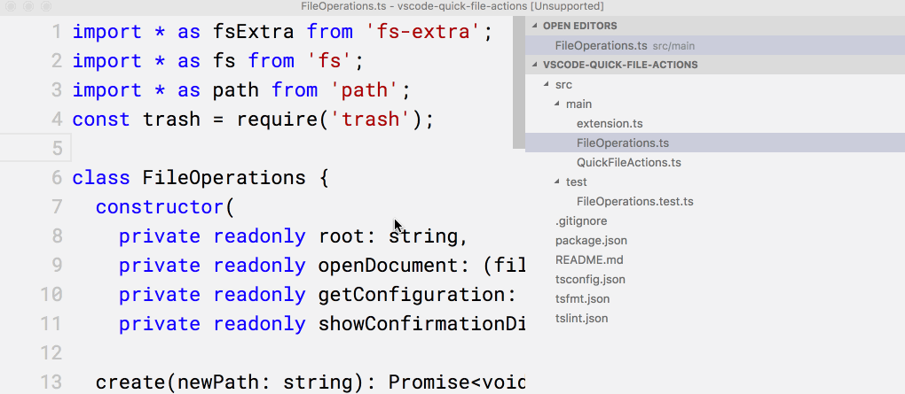

# vscode-quick-file-actions

Quickly create, copy, delete, and move files.

## Features

### Create
Prompts the user to create a new file in the same directory as the currently opened file.
If no file is open, defaults to the workspace root.
If the target file already exists, prompts the user to confirm the replacement.

`ctrl+alt+f n`

### Copy
Prompts the user to copy the current file to a new location.
If the new location is a path, copy the file into that directory, if not,
copies and renames it to the input value.
If the target file already exists, prompts the user to confirm the replacement.

`ctrl+alt+f c`

### Delete
Prompts the user to delete a path, files or directories.
By default moves the deleted files to the trash bin.

`ctrl+alt+f d`

### Move
Prompts the user to move the current file to a new location.
If the new location is a path, move the file into that directory, if not,
moves and renames it to the input value.
If the target file already exists, prompts the user to confirm the replacement.

`ctrl+alt+f m`

## Extension Settings

|Name|Setting|Default value|
|-|-|-|
|`quick-file-actions.moveToTrash`|Controls whether the delete action moves the file/directory to the trash bin or permanently deletes it.|`true`|
|`quick-file-actions.confirmOnDelete`|Controls whether to show a confirmation dialog when deleting files.|`true`|
|`quick-file-actions.confirmOnReplace`|Controls whether a confirmation dialog should be shown if the target file already exist when copying, creating, or moving.|`true`|

### 1.0.0

Initial release.
